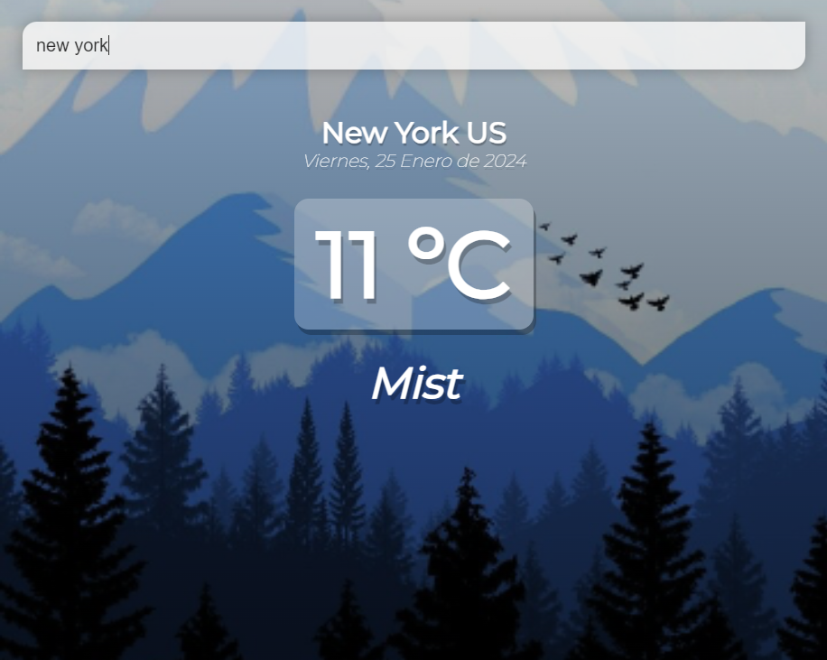

# Weather Vue

Simple VueJS web application to check the actual weather in any city powered by <https://openweathermap.org/api>.

<div align="center">
  
</div>

## Project setup
To install all the dependencies, we can run the command:
```
npm install
```

We can use this command to run the application:
```
npm run serve
```

The app will be deployed in <http://localhost:8080>
